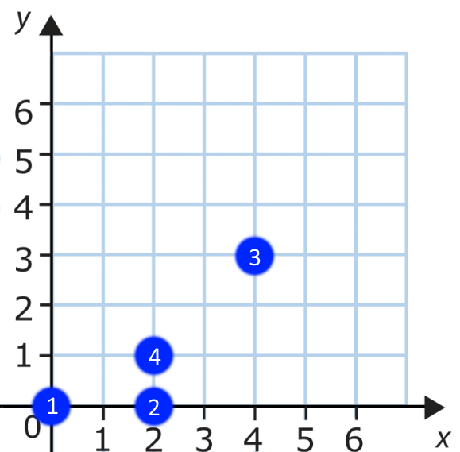

- Difficulty: Easy
- Type: Codewriting
- Score: 300

# closestCells

You are playing a game on a rectangular checkerboard with a specific set of rules.
Each game piece has a unique `id` and each cell on the board is defined by its `x` and `y` coordinates.

The current positions of your pieces on the board are stored in the **positions** table with the following structure:

- `id`: unique piece id;
- `x`: x coordinate of the cell that the piece with id `id`occupies;
- `y`: y coordinate of the cell that the piece with id `id`occupies.

In this game each piece on the board is said to *defend* its nearest neighbor. The distance between two pieces is calculated simply as the distance between the points `(x1, y1)` and `(x2, y2)`, where `(x1, y1)` and `(x2, y2)` are the coordinates of the cells occupied by the first and the second piece, respectively.
You thought it might be good idea to find what piece each of the game pieces *defends*.

Given the **positions** table, compose the resulting table with two columns: `id1` and `id2`, such that on each row the piece with id `id1` *defends* the piece with `id2` (i.e. `id2` is the closest to `id1`piece).
The table should be sorted by the values of `id1` in *ascending*order.
It's guaranteed that for each piece there is only one other piece closest to it.

**Example**

For the following table **positions**

| id   | x    | y    |
| ---- | ---- | ---- |
| 1    | 0    | 0    |
| 2    | 2    | 0    |
| 3    | 4    | 3    |
| 4    | 2    | 1    |

the output should be

| id1  | id2  |
| ---- | ---- |
| 1    | 2    |
| 2    | 4    |
| 3    | 4    |
| 4    | 2    |

- **[execution time limit] 10 seconds (mysql)**